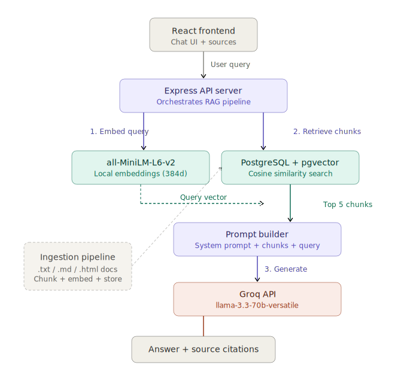

# Interview Prep RAG Assistant

A personal RAG-powered interview preparation tool that lets you chat with your own documents — STAR stories, LeetCode notes, behavioral prep, and more.

**Stack:** React + Vite (frontend), Express (backend), PostgreSQL + pgvector (vector store), Transformers.js (local embeddings), Groq + Llama 3.3 70B (chat)

**Cost:** $0 — embeddings run locally, chat uses Groq's free tier.

---

## Quick Start

### Prerequisites

- Node.js 18+
- PostgreSQL with [pgvector](https://github.com/pgvector/pgvector) extension
- A free [Groq API key](https://console.groq.com/keys)

### 1. Set up PostgreSQL + pgvector

```bash
# macOS (Homebrew)
brew install postgresql@17 pgvector
brew services start postgresql@17

# Create the database
createdb interview_rag

# Enable pgvector
psql interview_rag -c "CREATE EXTENSION IF NOT EXISTS vector;"
```

### 2. Set up the backend

```bash
cd backend
npm install
cp .env.example .env
```

Edit `.env` and add your Groq API key and PostgreSQL connection string.

### 3. Add your documents

Drop `.txt`, `.md`, and `.html` files into `backend/docs/`:

```
backend/docs/
  ├── star-stories.md
  ├── leetcode-notes.md
  ├── behavioral-prep.txt
  └── ...
```

**Tip:** Convert PDFs to markdown using [marker](https://github.com/VikParuchuri/marker) for better chunking.

### 4. Run ingestion

```bash
npm run ingest
```

Reads your docs, chunks them (800 chars, 150 overlap), generates embeddings locally via Transformers.js, and stores everything in PostgreSQL with pgvector.

### 5. Start the backend

```bash
npm run dev
```

Server runs on `http://localhost:3001`.

### 6. Start the frontend

```bash
cd ../frontend
npm install
npm run dev
```

Opens on `http://localhost:5173`.

---

## Architecture

<p align="center">
  
</p>

## API Endpoints

| Endpoint | Method | Description |
|---|---|---|
| `/api/query` | POST | Full RAG — retrieves chunks + generates answer |
| `/api/retrieve` | POST | Retrieval only — returns matching chunks without LLM |
| `/api/stats` | GET | Returns total chunk count |

## Project Structure

```
InterviewPrep-RAG/
├── backend/
│   ├── server.js          # Express API — orchestrates RAG pipeline
│   ├── ingest.js          # Document chunking + embedding + pgvector storage
│   ├── docs/              # Your documents go here (gitignored)
│   ├── .env.example
│   └── package.json
├── frontend/
│   ├── src/
│   │   ├── App.jsx        # Chat UI with source citations
│   │   └── main.jsx
│   ├── index.html
│   ├── vite.config.js
│   └── package.json
└── README.md
```

## Things to Experiment With

- **Chunk size:** Try 500 vs 800 vs 1200 characters and see how retrieval quality changes
- **Top K:** Retrieve 3 vs 5 vs 10 chunks — more context isn't always better
- **System prompt:** Tweak the prompt in `server.js` for different response styles
- **Embedding models:** Try different Hugging Face models via Transformers.js
- **Metadata filtering:** Add tags to your docs and filter at query time
